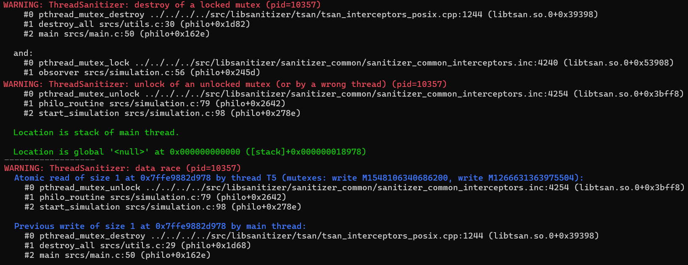
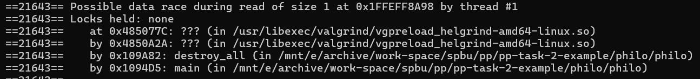

# Отчёт по второй задаче

## Исходный проект
Необходимо было найти проект на `C/C++`, содержащий элементы параллельного программирования, но не использующий библиотку `OpenMP`. Немаловажным критерием был объём исходного кода. Выбор пал на [проект](https://github.com/dpetrosy/42-Philosophers) от автора [Davit Petrosyan](https://github.com/dpetrosy), представляющий из себя некоторую демонстрацию самой простой стратегии накормить философов из задачи о философах.

Как можно догодаться, далее будет рассматриваться и правиться эта самая демонстрация, искодный код котрой можно посмотреть [здесь](https://github.com/Arsene-Baitenov/pp-task-2-example/tree/master/philo). Возможность deadlock исключается благодаря указанию времени, по истечении которого философ сыграет в ящик.

При старте приложения происходит инициализация необходимых структур данных, в том числе мьютексов. После чего запускается лаунчер который, инициирует запуск потоков для философов, крутящих бесконечные циклы, и запуск потока для сущности `obsorver` проверяющей условия окончания трапезы. В лаунчере ожидается окончании работы `obsorver`, после чего вызывается функция `destroy_all`, разрушающая мьютексы, и приложение заканчивает работу.

## Анализ с помощью threadsanitizer и helgrind
Добавив флаги `-fsanitize=thread -g` в `Makefile`, собрав решение и запустив (`./philo 5 800 200 200 7`) решение для 5 философов с временем возможного голодания 800, можно словить логи:
 1. `WARNING: ThreadSanitizer: destroy of a locked mutex`;
 2. `WARNING: ThreadSanitizer: unlock of an unlocked mutex`;
 3. `WARNING: ThreadSanitizer: data race`.

Первая сиутация получается в случае, когда `obsorver` успел убедиться, что все философы наелись или кто-то из них приказал долго жить, и после этого вызвалась функция `destroy_all` до того, как один из философов успевает освободить мьюьтекс, который будет разрушен.

Из первой ситуации вытекает вторая, когда после разрушения мьютекса, поток пытается его освободить.

И тут же `threadsanitizer` видит потенциальную гонку данных, а именно неизвестно, что произойдёт раньше мьютекс разрушится или поток философа успеет его осовободить.

Эту же гонку данных можно увидеть с помощью `helgrind`:

Всё это объясняется тем, что при вызове `pthread_mutex_destroy()` с переданным заблокированным мьютексом, мы получим непредсказуемое поведение.

## Решение проблем
Для решения проблем нужно научиться гарантировать то, что мьютексы свободны непосредственно перед попыткой их разрушения.

`obsorver` пытается захватить мьютекс `meal_lock` для проверки условий выхода через взаимодействие с данными каждого из философов, например время последнего приёма пищи. При попытке сытно пообедать каждый философ захватывает мьютексы вилок, захватывает мьютекс `meal_lock`, изменяет те самые данные, отпускает его и вызывает `ft_usleep`, иммитируя процесс обедни, отпускает вилки, а дальше, как в поговрке "после плотного обеда по закону Архимеда, чтобы жиром не заплыть, полагается поспать", пытается поспать.

Решением данной проблемы будет перенесение проверки условий окончания трапезы в потоки философов, для этого всего лишь нужно ввести общий флаг, который будет взводиться, когда кто бы то ни был из философов испустит дух. Таким образом, сущьность `obsorver` удаляется за не надобностью. А мьютексы разрущаются после завершения работы потоков философов. Исправления можно найти [здесь](https://github.com/Arsene-Baitenov/pp-task-2-example/tree/fix/remove-data-race/philo).

Также можно убедиться, что логи `threadsanitizer` пропадут

`helgrind` ещё будет ругаться на блокировку мьтексов вилок разными философами, однако это демонстрация, которая заставляет их ждать, если нужные столовые приборы заняты.